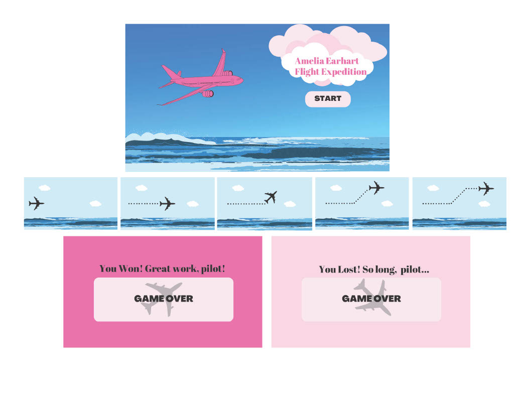

:warning: Everything between << >> needs to be replaced (remove << >> after replacing)

# Amelia Earhart Flight Expedition
## CS110 Final Project  Spring 2023

## Team Members

Grace Podgurski

***

## Project Description

My project will be a flight simulator game - starting in 2D above view but may try to develop it into a pilot POV. Goal will be to fly across the Atlantic Ocean as Amelia Earhart while avoiding obstacles including clouds, other aircrafts, and whatever else I can come up with.

***    

## GUI Design

### Initial Design

### Final Design

## Program Design

### Features

1. Start Menu
2. Moveable character (plane/pilot)
3. Obstacle Collision (clouds/other aircrafts)
4. Moving background as you play
5. Game Over screen with win or lose message

### Classes
StartView 
- use pygame menu

Character - called  Pilot
- shape & size
-  score
- movement (update position) - done in controller?

Obstacles
- shape & size
- where on screen (make random)

EndView 
- ends when player hits an obstacle or reaches distance of atlantic ocean 
- displays the 

## ATP

| Step                 |Procedure             |Expected Results                   |
|----------------------|:--------------------:|----------------------------------:|
|  1                   | Run Counter Program  |GUI window appears with count = 0  |
|  2                   | click count button   | display changes to count = 1      |
etc...
